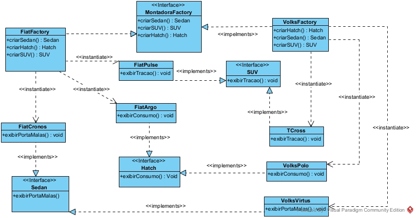

# VeiculosFactory
projeto da criação de veículos utilizando Factory Method em Java com Swing

# Alunos: 
Bruno Aparecido Vivencio Rodrigues 
 
Igor Nogueira Pessoa

# Diagrama de Classes
    

# Desafio (mudança de mercado)
Ao adicionar o novo tipo de produto SUV à MontadoraFactory, foi necessário incluir o método SUV criarSUV() na interface. Essa alteração quebrou a compilação das classes FiatFactory e VolksFactory, que já implementavam MontadoraFactory mas não possuíam esse novo método. O Java exige que toda classe concreta implemente 100% dos métodos declarados na interface que ela assina.

O Abstract Factory define um contrato fixo entre a fábrica abstrata e suas implementações. Enquanto a família de produtos permanece estável (Sedan e Hatch), novas montadoras podem ser adicionadas livremente, sem afetar o código existente. Porém, ao surgir um novo tipo de produto (SUV), o próprio contrato precisa mudar e qualquer alteração numa interface se propaga obrigatoriamente para todas as classes que a implementam, exigindo edição manual de cada uma.

Esse comportamento viola o Princípio Aberto/Fechado (Open/Closed Principle) sempre que o eixo de extensão é o tipo de produto, em vez do fabricante. Adicionar uma montadora nova é simples e não quebra nada mas já adicionar um produto novo obriga a tocar em toda fábrica já existente.
